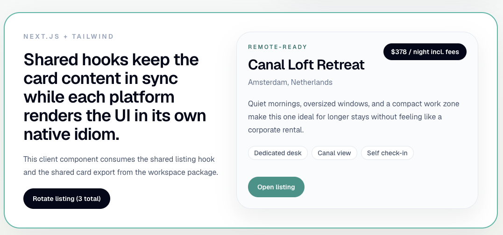
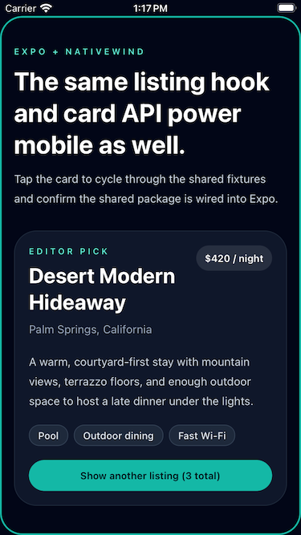

# unified-listing-cards

Cross-platform listing card prototype built with Next.js (web) and Expo (mobile), sharing hooks, data, view-model, tokens, and experiment logic from a common `packages/shared` package.

**Live demo:** https://wilsontr.github.io/unified-listing-cards

**Mobile (Expo Go):** scan the QR code below with the [Expo Go](https://expo.dev/go) app, or open the link on your device.

[](https://expo.dev/accounts/wilsontr/projects/unified-listing-cards/updates)

## Screenshots

### Web



### Mobile



## Commands

Install from the repo root:

```bash
npm install
```

Run the web app:

```bash
npm run dev:web
```

Run the Expo app:

```bash
npm run dev:mobile
```

Typecheck everything:

```bash
npm run typecheck
```

Run unit tests:

```bash
npm test
```

## Workspace layout

- `apps/web`: Next.js + React + Tailwind CSS v4 + Vitest
- `apps/mobile`: Expo + React Native + Nativewind + Jest
- `packages/shared`: shared hooks, fixtures, view-model, token constants, experiment module, and cross-platform component exports

## What is shared vs. platform-specific

### Shared (`packages/shared`)

| Export                          | Purpose                                                                                                                                                                            |
| ------------------------------- | ---------------------------------------------------------------------------------------------------------------------------------------------------------------------------------- |
| `FEATURED_LISTINGS` / `Listing` | Data contract — the canonical set of listing fixtures and their type                                                                                                               |
| `useFeaturedListing()`          | Carousel hook — manages current listing index and wrap-around cycling                                                                                                              |
| `getListingViewModel(listing)`  | View-model layer — derives display strings (`formattedPrice`, `dealQualityLabel`, `isHighlighted`, `allInPriceLabel`, `scarcityLabel`) from the `Listing` type without changing it |
| `webTokens` / `nativeTokens`    | Semantic token constants — map role names (`surface`, `textPrimary`, `accentFg`, `badgeBg`) to Tailwind class strings for the respective platform theme                            |
| `getListingCardVariant(key)`    | Experiment helper — returns the active `ListingCardVariant` (`"control"`, `"compact"`, `"highlighted"`) for a flag key from a static local map                                     |
| `ListingCard`                   | Re-export resolved by platform suffix — `.web.tsx` on web, `.native.tsx` on mobile                                                                                                 |

### Platform-specific

| Aspect                | Web (`ListingCard.web.tsx`)              | Mobile (`ListingCard.native.tsx`)          |
| --------------------- | ---------------------------------------- | ------------------------------------------ |
| Color scheme          | Light (slate-50 surface, slate-950 text) | Dark (slate-900 surface, white text)       |
| Root element          | `<article>` — semantic HTML              | `<Pressable>` — React Native touchable     |
| Touch affordance      | `<button>` + hover states                | Full-card `Pressable`, `active:opacity-90` |
| Accent color          | teal-700 (light theme)                   | teal-300 (dark theme)                      |
| Scarcity signal color | teal-700 (`webTokens.accentFg`)          | amber-300 (warmer on dark background)      |

## Web: before and after hydration

The web card is fully server-rendered. On first load:

1. **Next.js server** renders `page.tsx` (Server Component) → calls `WebListingShowcase` (Client Component) → renders `ListingCard.web.tsx` to an HTML string.
2. **Initial HTML** includes the listing title, badge, location, price, summary, and amenities. No JavaScript is required to read this content (visible in `view-source`).
3. **Browser downloads** the JS bundle and React hydrates `WebListingShowcase`.
4. `useFeaturedListing()` initialises on the client with index 0 — matching the server render, so **no layout shift** occurs.
5. Event handlers (`onClick`) attach to the rotate button and card action button.
6. Clicking "Rotate listing" updates state, cycling through `FEATURED_LISTINGS`.

## Experiment variants

`getListingCardVariant(key)` reads from a static flag map in `packages/shared/src/experiments.ts`. The current flags are:

| Key                      | Variant         |
| ------------------------ | --------------- |
| `listing-card-highlight` | `"highlighted"` |
| `listing-card-compact`   | `"compact"`     |
| _(any other key)_        | `"control"`     |

The `"highlighted"` variant adds an accent border ring around the card. Call sites pass the resolved variant to `ListingCard` via the `variant` prop. Components do not decide their own variant.

## Evolution path

### Adding a new listing attribute

1. Add the field (optional or required) to `Listing` in `packages/shared/src/listings.ts` and update `FEATURED_LISTINGS`.
2. Add the corresponding display field to `ListingViewModel` in `listing-view-model.ts` with any fallback logic (e.g. `allInPriceLabel` falls back to `formattedPrice`; `scarcityLabel` defaults to `""`). Do not add display logic inside components.
3. Add assertions to `listing-view-model.test.ts` covering the populated and absent/fallback cases.
4. Update `listings.test.ts` to assert the new field is present (and of the right type) on all fixtures.

### Adding a new design token role

1. Add the key to `SemanticTokens` in `packages/shared/src/tokens.ts`.
2. Add the Tailwind class string value to both `webTokens` and `nativeTokens`.
3. Update `tokens.test.ts` to assert the new key.

### Adding a new A/B variant

1. Add the variant name to the `ListingCardVariant` union type in `packages/shared/src/experiments.ts`.
2. Add the flag key → variant mapping to `FLAG_MAP`.
3. Update `experiments.test.ts` to cover the new key.
4. Add the new visual treatment to both `ListingCard` components under the variant condition.
